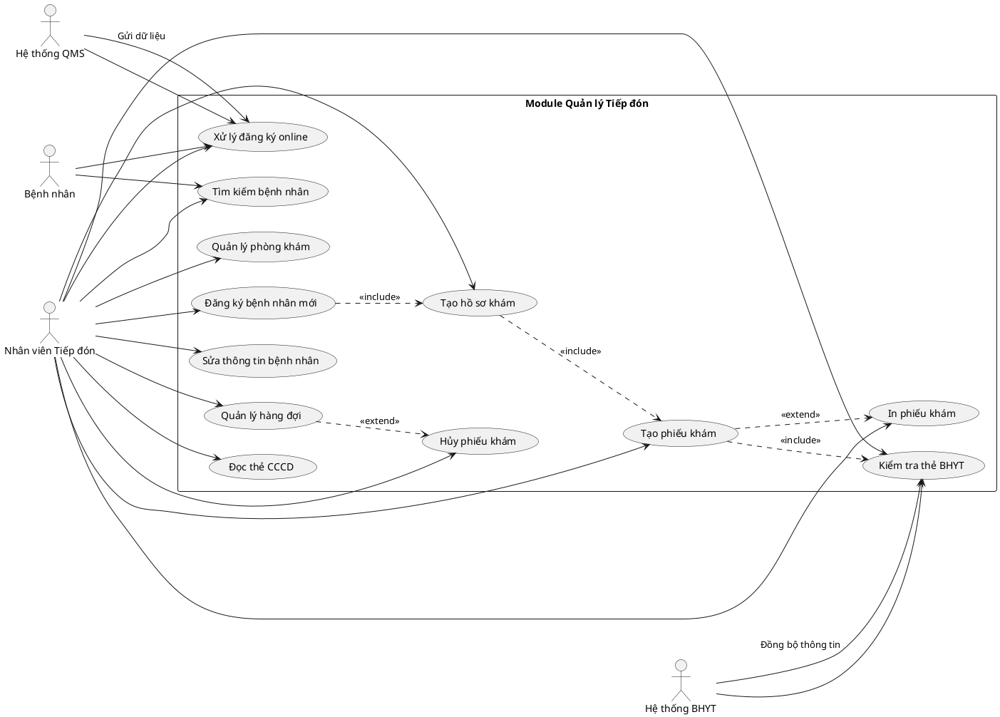
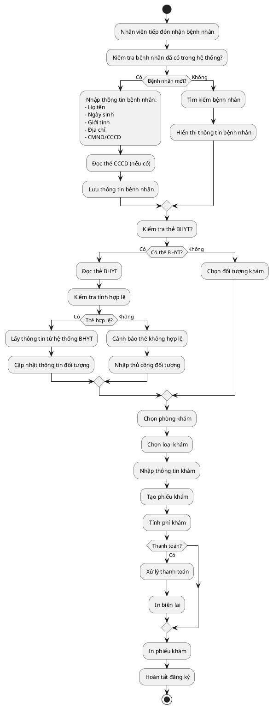
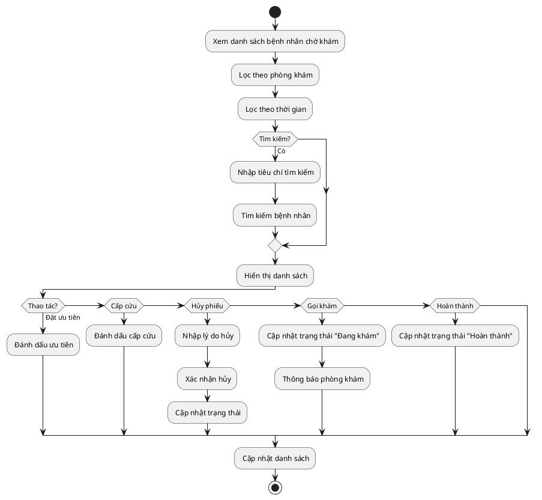
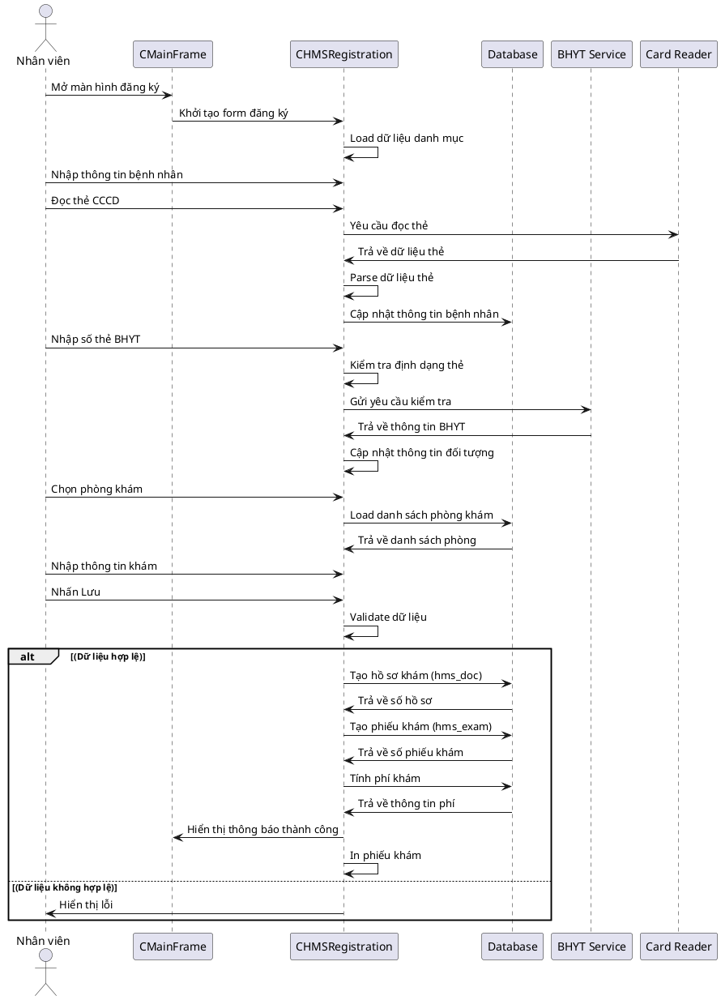
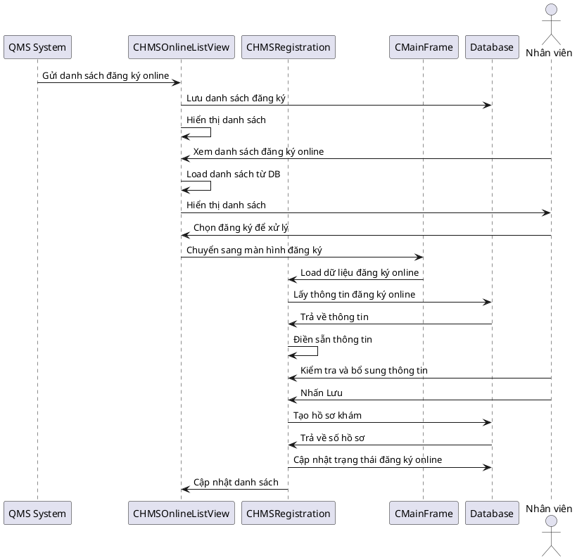
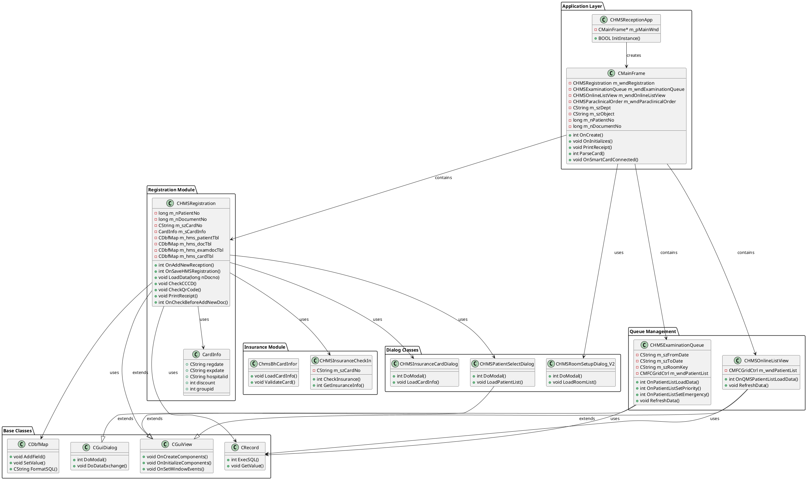

# TÀI LIỆU KỸ THUẬT - MODULE QUẢN LÝ TIẾP ĐÓN (VIMESReceptionMangr)

## MỤC LỤC
1. [Tổng quan](#1-tổng-quan)
2. [Các chức năng chính](#2-các-chức-năng-chính)
3. [Sơ đồ Use Case](#3-sơ-đồ-use-case)
4. [Sơ đồ Activity](#4-sơ-đồ-activity)
5. [Sơ đồ Sequence](#5-sơ-đồ-sequence)
6. [Sơ đồ Class Diagram](#6-sơ-đồ-class-diagram)
   - [6.1. Phân tích chi tiết các Class](#61-phân-tích-chi-tiết-các-class)
   - [6.2. Các Dialog Class](#62-các-dialog-class)
   - [6.3. Các Helper Class và Utility](#63-các-helper-class-và-utility)
   - [6.4. Các Function và Utility](#64-các-function-và-utility)
   - [6.5. Các Constant và Enum](#65-các-constant-và-enum)
   - [6.6. Các Configuration và Settings](#66-các-configuration-và-settings)
7. [Các bảng dữ liệu chính](#7-các-bảng-dữ-liệu-chính)
8. [Các Stored Procedures chính](#8-các-stored-procedures-chính)
9. [Tích hợp với hệ thống khác](#9-tích-hợp-với-hệ-thống-khác)
10. [Bảo mật và phân quyền](#10-bảo-mật-và-phân-quyền)
11. [Xử lý lỗi và ngoại lệ](#11-xử-lý-lỗi-và-ngoại-lệ)
12. [Tài liệu tham khảo](#12-tài-liệu-tham-khảo)

---

## 1. TỔNG QUAN

### 1.1. Giới thiệu
Module **VIMESReceptionMangr** là một ứng dụng quản lý tiếp đón bệnh nhân trong hệ thống quản lý bệnh viện (HMS). Module này được xây dựng bằng C++/MFC trên nền tảng Windows, cung cấp các chức năng quản lý đăng ký khám bệnh, quản lý hàng đợi, và xử lý thông tin bảo hiểm y tế.

### 1.2. Mục đích
- Quản lý thông tin đăng ký khám bệnh của bệnh nhân
- Xử lý và quản lý hàng đợi khám bệnh
- Tích hợp với hệ thống bảo hiểm y tế
- Hỗ trợ đọc thẻ CCCD và thẻ BHYT
- Quản lý phòng khám và lịch khám
- In các loại phiếu khám và biên lai

### 1.3. Kiến trúc hệ thống
- **Framework**: MFC (Microsoft Foundation Classes)
- **Ngôn ngữ**: C++
- **Database**: Oracle (thông qua các stored procedures và views)
- **UI Framework**: Custom GUI Framework (CGuiView, CGuiDialog)

### 1.4. Cấu trúc thư mục
```
VIMESReceptionMangr/
├── MainFrm.h/cpp          # Main Frame của ứng dụng
├── HMSReceptionApp.h/cpp   # Application class
├── HMSRegistration.h/cpp  # Quản lý đăng ký bệnh nhân
├── HMSExaminationQueue.h/cpp # Quản lý hàng đợi khám
├── HMSOnlineListView.h/cpp   # Danh sách bệnh nhân online
├── Resx/                   # Resource files
├── Capture/                # Module chụp ảnh
└── Reports/                # Báo cáo
```

---

## 2. CÁC CHỨC NĂNG CHÍNH

### 2.1. Quản lý Đăng ký Bệnh nhân (HMSRegistration)
- **Đăng ký bệnh nhân mới**: Nhập thông tin bệnh nhân lần đầu đến khám
- **Tạo hồ sơ khám mới**: Tạo hồ sơ khám bệnh cho bệnh nhân
- **Tạo phiếu khám mới**: Tạo phiếu khám cho từng lần khám
- **Sửa thông tin bệnh nhân**: Cập nhật thông tin cá nhân của bệnh nhân
- **Sửa thông tin hồ sơ**: Chỉnh sửa thông tin hồ sơ khám bệnh
- **Sửa thông tin phiếu khám**: Cập nhật thông tin phiếu khám
- **Quản lý thẻ BHYT**: Kiểm tra và cập nhật thông tin bảo hiểm y tế
- **In phiếu khám**: In các loại phiếu khám, biên lai

### 2.2. Quản lý Hàng đợi Khám (HMSExaminationQueue)
- **Xem danh sách bệnh nhân chờ khám**: Hiển thị danh sách bệnh nhân đang chờ
- **Tìm kiếm bệnh nhân**: Tìm kiếm theo số hồ sơ, tên, phòng khám
- **Quản lý trạng thái khám**: Cập nhật trạng thái (chờ, đang khám, hoàn thành)
- **Thiết lập ưu tiên**: Đánh dấu bệnh nhân ưu tiên hoặc cấp cứu
- **Hủy phiếu khám**: Hủy phiếu khám với lý do

### 2.3. Quản lý Danh sách Online (HMSOnlineListView)
- **Xem danh sách bệnh nhân đăng ký online**: Hiển thị danh sách từ hệ thống QMS
- **Đồng bộ dữ liệu**: Đồng bộ thông tin từ hệ thống đặt khám online
- **Xử lý đăng ký online**: Chuyển đổi đăng ký online thành phiếu khám

### 2.4. Quản lý Bảo hiểm Y tế
- **Kiểm tra thẻ BHYT**: Kiểm tra tính hợp lệ của thẻ BHYT
- **Đồng bộ thông tin BHYT**: Kết nối với hệ thống BHYT để lấy thông tin
- **Quản lý đối tượng**: Phân loại đối tượng hưởng BHYT
- **Tính toán chiết khấu**: Tính toán mức chiết khấu theo đối tượng

### 2.5. Tích hợp Đọc thẻ
- **Đọc thẻ CCCD**: Tích hợp máy đọc thẻ CCCD để tự động nhập thông tin
- **Đọc thẻ BHYT**: Đọc thông tin từ thẻ BHYT
- **Đọc QR Code**: Quét QR code để nhập thông tin

### 2.6. Quản lý Phòng khám
- **Thiết lập phòng khám**: Cấu hình các phòng khám
- **Phân bổ phòng**: Tự động hoặc thủ công phân bổ bệnh nhân vào phòng
- **Quản lý lịch khám**: Quản lý lịch khám theo phòng

### 2.7. Báo cáo và In ấn
- **In phiếu khám**: In phiếu khám bệnh
- **In biên lai**: In biên lai thu phí
- **In phiếu tái khám**: In phiếu hẹn tái khám
- **Báo cáo thống kê**: Các báo cáo thống kê tiếp đón

---

## 3. SƠ ĐỒ USE CASE



---

## 4. SƠ ĐỒ ACTIVITY

### 4.1. Quy trình Đăng ký Bệnh nhân Mới



### 4.2. Quy trình Quản lý Hàng đợi



---

## 5. SƠ ĐỒ SEQUENCE

### 5.1. Sequence Diagram - Đăng ký Bệnh nhân Mới



### 5.2. Sequence Diagram - Xử lý Đăng ký Online



---

## 6. SƠ ĐỒ CLASS DIAGRAM



---

## 6.1. PHÂN TÍCH CHI TIẾT CÁC CLASS

### 6.1.1. CHMSReceptionApp
**Mục đích**: Class chính của ứng dụng, kế thừa từ `CMFCWinApp`.

**Thuộc tính chính**:
- `m_pMainWnd`: Con trỏ đến cửa sổ chính

**Method chính**:
- `InitInstance()`: Khởi tạo ứng dụng, tạo và hiển thị MainFrame

### 6.1.2. CMainFrame
**Mục đích**: Cửa sổ chính của ứng dụng, quản lý các view và xử lý sự kiện toàn cục.

**Thuộc tính chính**:
- `m_wndRegistration`: View đăng ký bệnh nhân
- `m_wndExaminationQueue`: View hàng đợi khám
- `m_wndOnlineListView`: View danh sách online
- `m_wndParaclinicalOrder`: View cận lâm sàng
- `m_szDept`: Mã khoa hiện tại
- `m_szObject`: Đối tượng hiện tại
- `m_nPatientNo`: Số bệnh nhân hiện tại
- `m_nDocumentNo`: Số hồ sơ hiện tại
- `m_bIsAutoCheckCard`: Tự động kiểm tra thẻ
- `m_bUseCCCDMachine`: Sử dụng máy đọc CCCD
- `m_szInsuranceWebService`: Cấu hình Web Service BHYT

**Method chính**:
- `OnCreate()`: Khởi tạo cửa sổ, tạo các view
- `OnInitializes()`: Khởi tạo dữ liệu, load cấu hình
- `ParseCard()`: Phân tích thông tin thẻ BHYT
- `PrintReceipt()`: In biên lai
- `OnSmartCardConnected()`: Xử lý khi thẻ được kết nối
- `OnSmartCardDisconnect()`: Xử lý khi thẻ bị ngắt kết nối
- `IsPatientInsuranceDaily()`: Kiểm tra bệnh nhân đã khám BHYT trong ngày
- `IsTreatmentTerminate()`: Kiểm tra điều trị đã kết thúc
- `ApplyInsuranceData()`: Áp dụng dữ liệu từ BHYT
- `OnTabSelectChange()`: Xử lý khi chuyển tab

### 6.1.3. CHMSRegistration
**Mục đích**: Class quản lý đăng ký bệnh nhân, là class phức tạp nhất trong module.

**Thuộc tính chính**:

**Thông tin bệnh nhân**:
- `m_nPatientNo`: Số bệnh nhân
- `m_nDocumentNo`: Số hồ sơ
- `m_szPatientName`: Tên bệnh nhân
- `m_szBirthDate`: Ngày sinh
- `m_szSexKey`: Giới tính
- `m_szAddressKey`: Địa chỉ
- `m_szIDNo`: Số CMND/CCCD
- `m_szPhone`: Số điện thoại

**Thông tin thẻ BHYT**:
- `m_szCardNo`: Số thẻ BHYT
- `m_sCardInfo`: Thông tin chi tiết thẻ (CardInfo struct)
- `m_szObjectKey`: Đối tượng
- `m_nDisrate`: Tỷ lệ chiết khấu

**Thông tin khám**:
- `m_szExamDate`: Ngày khám
- `m_szRoomKey`: Phòng khám
- `m_szExamTypeKey`: Loại khám
- `m_szSheetNo`: Số phiếu khám
- `m_szDisease`: Chẩn đoán

**UI Controls**:
- `m_wndPatientNo`: Control nhập số bệnh nhân
- `m_wndPatientName`: Control nhập tên
- `m_wndCardNo`: Control nhập số thẻ BHYT
- `m_wndRoomList`: Danh sách phòng khám
- `m_wndExamList`: Danh sách phiếu khám

**Data Tables**:
- `m_hms_patientTbl`: Bảng dữ liệu bệnh nhân
- `m_hms_docTbl`: Bảng dữ liệu hồ sơ
- `m_hms_examdocTbl`: Bảng dữ liệu phiếu khám
- `m_hms_cardTbl`: Bảng dữ liệu thẻ BHYT

**Method chính - Quản lý bệnh nhân**:
- `OnAddNewReception()`: Tạo đăng ký mới
- `OnAddNewDocument()`: Tạo hồ sơ mới
- `OnSaveHMSRegistration()`: Lưu thông tin đăng ký
- `OnSaveHMSRegistration2()`: Lưu đăng ký (phiên bản 2)
- `OnEditHMSRegistration()`: Sửa thông tin đăng ký
- `OnDeleteHMSRegistration()`: Xóa đăng ký
- `LoadData(long nDocno)`: Load dữ liệu từ số hồ sơ
- `LoadByPatientNo(long nPatientNo)`: Load dữ liệu từ số bệnh nhân
- `CheckDupPatient()`: Kiểm tra trùng lặp bệnh nhân

**Method chính - Xử lý thẻ**:
- `CheckCCCD(LPCTSTR lpszCard)`: Kiểm tra và xử lý thẻ CCCD
- `CheckQrCode(LPCTSTR lpszCard)`: Kiểm tra và xử lý QR Code
- `ParseCard()`: Phân tích thông tin thẻ BHYT
- `OnCheckInsSelect()`: Kiểm tra thẻ BHYT
- `IsCheckCardInfo()`: Kiểm tra thông tin thẻ
- `SetCardInfo()`: Thiết lập thông tin thẻ từ JSON

**Method chính - Quản lý phòng khám**:
- `OnRoomListLoadData()`: Load danh sách phòng khám
- `OnRoomListLoadData_V2()`: Load danh sách phòng khám (v2)
- `OnRoomListSelectChange()`: Xử lý khi chọn phòng
- `OnRoomListDblClick()`: Xử lý double click phòng
- `OnRoomListDeleteItem()`: Xóa phòng khỏi danh sách

**Method chính - Quản lý phiếu khám**:
- `OnExamListLoadData()`: Load danh sách phiếu khám
- `OnExamListSelectChange()`: Xử lý khi chọn phiếu khám
- `OnExamListDblClick()`: Xử lý double click phiếu khám
- `OnExamListDeleteItem()`: Xóa phiếu khám
- `OnExamListCancelItem()`: Hủy phiếu khám
- `OnExamListSetPriority()`: Đặt ưu tiên phiếu khám
- `AddExaminationReceipt()`: Thêm phiếu khám

**Method chính - Validation**:
- `OnPatientNoCheckValue()`: Validate số bệnh nhân
- `OnDocumentNoCheckValue()`: Validate số hồ sơ
- `OnCardNoCheckValue()`: Validate số thẻ BHYT
- `OnPatientNameCheckValue()`: Validate tên bệnh nhân
- `OnAgeCheckValue()`: Validate tuổi
- `OnBirthDateCheckValue()`: Validate ngày sinh
- `isValidPhoneNumber()`: Validate số điện thoại
- `isValidIdCardNumber()`: Validate số CMND/CCCD
- `OnCheckBeforeAddNewDoc()`: Kiểm tra trước khi tạo hồ sơ mới

**Method chính - In ấn**:
- `PrintReceipt()`: In biên lai
- `PrintFastFoodReceipt()`: In biên lai fast food
- `PrintTreatment()`: In phiếu điều trị
- `PrintAppointmentExamine()`: In phiếu hẹn tái khám
- `PrintDeposit()`: In phiếu đặt cọc
- `OnPrintTriageC13()`: In phiếu phân loại C13

**Method chính - Tích hợp**:
- `OnSendTPH()`: Gửi dữ liệu lên TPH
- `OnUpdateExtInsCard()`: Cập nhật thẻ BHYT mở rộng
- `OnUpdateVaccineCovid19InFor()`: Cập nhật thông tin vaccine COVID-19
- `OnUpdateIVFDiscountInFor()`: Cập nhật chiết khấu IVF
- `NhanLichSuKCB_BH()`: Nhận lịch sử khám BHYT
- `OnSynInForFromHIStoLIS()`: Đồng bộ thông tin từ HIS sang LIS

**Method chính - Khác**:
- `OnFunctionalTest()`: Nhập chức năng sống
- `OnViewEMR()`: Xem hồ sơ bệnh án điện tử
- `OnCreateAdministrationForm()`: Tạo mẫu biểu hành chính
- `OnSetDiscountPatient()`: Thiết lập chiết khấu bệnh nhân
- `ProcessIdCardQrInput()`: Xử lý input từ QR Code CMND

### 6.1.4. CHMSExaminationQueue
**Mục đích**: Quản lý hàng đợi khám bệnh.

**Thuộc tính chính**:
- `m_szFromDate`, `m_szFromTime`: Thời gian bắt đầu
- `m_szToDate`, `m_szToTime`: Thời gian kết thúc
- `m_szRoomKey`: Mã phòng khám
- `m_nDocumentNo`: Số hồ sơ
- `m_szPatientName`: Tên bệnh nhân
- `m_szCIC`: Số CCCD
- `m_bKhamNhanVienLabel`: Khám nhân viên
- `m_bXnnguoinha`: Xét nghiệm người nhà
- `m_wndPatientList`: Danh sách bệnh nhân

**Method chính**:
- `OnPatientListLoadData()`: Load danh sách bệnh nhân
- `OnPatientListSelectChange()`: Xử lý khi chọn bệnh nhân
- `OnPatientListDblClick()`: Xử lý double click
- `OnPatientListSetPriority()`: Đặt ưu tiên
- `OnPatientListSetEmergency()`: Đặt cấp cứu
- `OnLoadSelect()`: Load dữ liệu
- `RefreshData()`: Làm mới dữ liệu
- `InVongDeoTay()`: In vòng đeo tay

### 6.1.5. CHMSOnlineListView
**Mục đích**: Quản lý danh sách đăng ký online từ QMS.

**Thuộc tính chính**:
- Tương tự `CHMSExaminationQueue`
- `m_wndPatientList`: Danh sách bệnh nhân online

**Method chính**:
- `OnQMSPatientListLoadData()`: Load danh sách từ QMS
- `OnPatientListDblClick()`: Xử lý double click để chuyển sang đăng ký
- `RefreshData()`: Làm mới dữ liệu

### 6.1.6. CardInfo (Struct)
**Mục đích**: Lưu trữ thông tin chi tiết của thẻ BHYT.

**Thuộc tính**:
- `regdate`: Ngày đăng ký
- `expdate`: Ngày hết hạn
- `hospitalid`: Mã bệnh viện
- `regplacecde`: Mã nơi đăng ký
- `company`: Công ty bảo hiểm
- `code`: Mã đối tượng
- `discount`: Tỷ lệ chiết khấu
- `groupid`: ID nhóm
- `xCardno`: Số thẻ mở rộng
- `xobject`: Đối tượng mở rộng
- `xIssuePlace`: Nơi cấp
- `xIssueDate`: Ngày cấp
- `szArea`: Khu vực
- `bxHema`: Có phải Hema không
- `szOver5year`: Trên 5 năm
- `szDateOfBirth`: Ngày sinh
- `szSex`: Giới tính

### 6.1.7. PatientInfo (Struct)
**Mục đích**: Lưu trữ thông tin bệnh nhân.

**Thuộc tính**:
- `nPatientNo`: Số bệnh nhân
- `nDocumentNo`: Số hồ sơ
- `szPatientName`: Tên bệnh nhân
- `nYearOfBirth`: Năm sinh
- `szBirthDate`: Ngày sinh
- `szSex`: Giới tính
- `szAddress`: Địa chỉ
- `szPhone`: Số điện thoại
- `szMaKhoa`: Mã khoa
- `szSoHoChieu`: Số hộ chiếu
- `szNgayCapHoChieu`: Ngày cấp hộ chiếu
- `szGhiChuHoChieu`: Ghi chú hộ chiếu

### 6.1.8. WorkPlaceInfo (Struct)
**Mục đích**: Lưu trữ thông tin nơi làm việc.

**Thuộc tính**:
- `szWorkPlaceID`: ID nơi làm việc
- `szWorkPlaceName`: Tên nơi làm việc
- `szDepartmentID`: ID phòng ban

### 6.1.9. PATIENT (Struct trong MainFrm.h)
**Mục đích**: Lưu trữ thông tin bệnh nhân cho danh sách.

**Thuộc tính**:
- `MAKCB`: Mã khám chữa bệnh
- `HOTEN`: Họ tên
- `NAMSINH`: Năm sinh
- `GIOITINH`: Giới tính
- `SOTHE`: Số thẻ
- `NGAYGIOVAO`: Ngày giờ vào
- `NGAYGIORA`: Ngày giờ ra
- `DIACHI`: Địa chỉ
- `MABENHVIEN`: Mã bệnh viện
- `TENBENHVIEN`: Tên bệnh viện
- `TENBENH`: Tên bệnh
- `MABENH`: Mã bệnh
- `TRANGTHAI`: Trạng thái
- `KQDIEUTRI`: Kết quả điều trị

---

## 6.2. CÁC DIALOG CLASS

### 6.2.1. CHMSPatientSelectDialog
**Mục đích**: Dialog chọn bệnh nhân từ danh sách.

### 6.2.2. CHMSInsuranceCardDialog
**Mục đích**: Dialog nhập/sửa thông tin thẻ BHYT.

### 6.2.3. CHMSRoomSetupDialog_V2
**Mục đích**: Dialog thiết lập phòng khám.

### 6.2.4. CHMSFindPatientinformationDialog
**Mục đích**: Dialog tìm kiếm thông tin bệnh nhân.

### 6.2.5. CHMSTreatmentHistoryDialog
**Mục đích**: Dialog xem lịch sử điều trị.

### 6.2.6. CHMSFeeDepositDialog
**Mục đích**: Dialog quản lý đặt cọc.

### 6.2.7. CHMSAdditionCardDialog
**Mục đích**: Dialog thêm thẻ BHYT phụ.

### 6.2.8. CHMSPriorityDialog
**Mục đích**: Dialog thiết lập ưu tiên.

### 6.2.9. CHMSSpecialExamDialog
**Mục đích**: Dialog khám đặc biệt.

### 6.2.10. CHMSFunctionalTestDialog
**Mục đích**: Dialog nhập chức năng sống.

### 6.2.11. CHMSCovid19VaccinInforDialog
**Mục đích**: Dialog thông tin vaccine COVID-19.

### 6.2.12. CHMSIVFDiscountInforDialog
**Mục đích**: Dialog thông tin chiết khấu IVF.

### 6.2.13. CHMSBirthPackageList
**Mục đích**: Dialog danh sách gói khám sinh.

### 6.2.14. CHMSDocumentPreviewDialog
**Mục đích**: Dialog xem trước tài liệu.

### 6.2.15. CHMSUploadFileDialog
**Mục đích**: Dialog upload file.

### 6.2.16. CHMSPatientNoChangeDialog
**Mục đích**: Dialog thay đổi số bệnh nhân.

### 6.2.17. CHMSDefaultDoctorSetupDlg
**Mục đích**: Dialog thiết lập bác sĩ mặc định.

### 6.2.18. CHMSHospitalListSetupDialog
**Mục đích**: Dialog thiết lập danh sách bệnh viện.

### 6.2.19. CHMSWifiSettingDialog
**Mục đích**: Dialog thiết lập WiFi.

### 6.2.20. CHMSGeneralReceptionReportDialog
**Mục đích**: Dialog báo cáo tiếp đón.

### 6.2.21. CHMSGeneralReceivableEFReportDialog
**Mục đích**: Dialog báo cáo công nợ.

### 6.2.22. CHMSInsuranceCardSettingDialog
**Mục đích**: Dialog thiết lập thẻ BHYT.

### 6.2.23. CHMSInsuranceCompanyDialog
**Mục đích**: Dialog quản lý công ty bảo hiểm.

### 6.2.24. CHMSInsregDateDialog
**Mục đích**: Dialog ngày đăng ký BHYT.

### 6.2.25. CHMSSetDisCountPatientDialog
**Mục đích**: Dialog thiết lập chiết khấu bệnh nhân.

### 6.2.26. CHMSCancelReasonDialog
**Mục đích**: Dialog lý do hủy.

### 6.2.27. CHMSCreateDepositDialog
**Mục đích**: Dialog tạo đặt cọc.

### 6.2.28. CHMSExtInsCardDialog
**Mục đích**: Dialog thẻ BHYT mở rộng.

### 6.2.29. CHMSExtInsCompanyDialog
**Mục đích**: Dialog công ty BHYT mở rộng.

### 6.2.30. CHMSExtInsUnpaidView
**Mục đích**: View công nợ BHYT mở rộng.

### 6.2.31. CHMSWorkPlaceDlg
**Mục đích**: Dialog nơi làm việc.

### 6.2.32. CHMSWorkPlace108StaffDlg
**Mục đích**: Dialog nơi làm việc nhân viên 108.

### 6.2.33. CHMSWorkingPlaceInfoDialog
**Mục đích**: Dialog thông tin nơi làm việc.

### 6.2.34. CHMSAddExtraInforUserDialog
**Mục đích**: Dialog thêm thông tin người dùng.

### 6.2.35. CHMSUpdateExtraInformation
**Mục đích**: Dialog cập nhật thông tin mở rộng.

### 6.2.36. CHMSEmpListDlg
**Mục đích**: Dialog danh sách nhân viên.

### 6.2.37. CHMSEmpInfoDlg
**Mục đích**: Dialog thông tin nhân viên.

### 6.2.38. CHMSPossitionSetupDialog
**Mục đích**: Dialog thiết lập chức vụ.

### 6.2.39. CHMSCardSearchDialog
**Mục đích**: Dialog tìm kiếm thẻ.

### 6.2.40. CHMSCardEntryDialog
**Mục đích**: Dialog nhập thẻ.

### 6.2.41. CHMSBirthPackageReg
**Mục đích**: Dialog đăng ký gói khám sinh.

### 6.2.42. CTransplantDialog
**Mục đích**: Dialog ghép tạng.

### 6.2.43. CViewPatientAndRelative
**Mục đích**: Dialog xem bệnh nhân và người thân.

### 6.2.44. CNationlityDialog
**Mục đích**: Dialog quốc tịch.

### 6.2.45. CHMSThietLap_Thongtin_Vaccine
**Mục đích**: Dialog thiết lập thông tin vaccine.

### 6.2.46. CHMSThietLap_Diachi_Vaccine
**Mục đích**: Dialog thiết lập địa chỉ vaccine.

### 6.2.47. CHMSThietLap_Thongtin_Vattu
**Mục đích**: Dialog thiết lập thông tin vật tư.

### 6.2.48. CRMCanCuocCDDlg
**Mục đích**: Dialog CMND/CCCD.

### 6.2.49. CHMS_Doc_Note
**Mục đích**: Dialog ghi chú hồ sơ.

### 6.2.50. CHMS_Doc_Note_View
**Mục đích**: View ghi chú hồ sơ.

### 6.2.51. ChmsBhCardInfor
**Mục đích**: Dialog thông tin thẻ BHYT.

### 6.2.52. Cbh_Kiemtrathongtinkham_BH
**Mục đích**: Dialog kiểm tra thông tin khám BHYT.

---

## 6.3. CÁC HELPER CLASS VÀ UTILITY

### 6.3.1. CImageView
**Mục đích**: Class hiển thị ảnh từ thẻ CCCD.

**Method**:
- `LoadAndShow()`: Load và hiển thị ảnh
- `OnPaint()`: Vẽ ảnh
- `SetPosition()`: Thiết lập vị trí

### 6.3.2. CMf5axctrl1
**Mục đích**: Control đọc thẻ RFID.

### 6.3.3. CPOSCommDevice
**Mục đích**: Thiết bị giao tiếp POS.

### 6.3.4. CStringToken
**Mục đích**: Utility phân tích chuỗi.

### 6.3.5. CDbfMap
**Mục đích**: Map dữ liệu để tạo SQL.

**Method**:
- `AddField()`: Thêm field
- `SetValue()`: Thiết lập giá trị
- `FormatSQL()`: Format thành SQL

### 6.3.6. CRecord
**Mục đích**: Class thực thi SQL và đọc kết quả.

**Method**:
- `ExecSQL()`: Thực thi SQL
- `GetValue()`: Lấy giá trị
- `GetIntValue()`: Lấy giá trị int
- `MoveNext()`: Di chuyển record tiếp theo
- `IsEOF()`: Kiểm tra cuối file

---

## 6.4. CÁC FUNCTION VÀ UTILITY

### 6.4.1. ParseInsuranceCardInfo
**Mục đích**: Phân tích thông tin thẻ BHYT từ chuỗi.

**Tham số**:
- `szCardInfo`: Chuỗi thông tin thẻ
- `arInfo`: Mảng kết quả

**Trả về**: `bool`

### 6.4.2. ParseCard (trong CMainFrame)
**Mục đích**: Phân tích thẻ BHYT để lấy mã đối tượng và chiết khấu.

**Tham số**:
- `szObject`: Đối tượng
- `szCardNo`: Số thẻ
- `szCode`: Mã trả về
- `nDiscount`: Chiết khấu
- `nGroupID`: ID nhóm

**Trả về**: `int`

### 6.4.3. parseIDCard0
**Mục đích**: Phân tích dữ liệu thẻ CCCD từ JSON.

**Tham số**:
- `pMF`: MainFrame
- `document`: JSON document

**Trả về**: `CString` (số CMND/CCCD)

### 6.4.4. base64Decode
**Mục đích**: Giải mã base64.

### 6.4.5. loadAndSaveImageFromBase64
**Mục đích**: Load và lưu ảnh từ base64.

### 6.4.6. KillProcessByName
**Mục đích**: Kill process theo tên.

---

## 6.5. CÁC CONSTANT VÀ ENUM

### 6.5.1. View Mode
- `VM_ADDEXAM (0x010)`: Thêm phiếu khám
- `VM_ADDDOC (0x020)`: Thêm hồ sơ
- `VM_ADDPAT (0x030)`: Thêm bệnh nhân

### 6.5.2. Command ID
- `ID_COMMAND_TEMPLATE`: Mẫu biểu
- `ID_COMMAND_FILES`: Files
- `ID_COMMAND_IMAGE`: Image
- `CMD_SIGNATURE`: EMR
- `ID_COMMAND_SEARCHINFORMATIONPATIENT`: Tìm kiếm
- `ID_COMMAND_COMPANYSETTING`: Khám sức khỏe
- `ID_COMMAND_FUNCTIONALTEST`: Chức năng sống

### 6.5.3. Message
- `PM_CARD`: Message thẻ
- `WM_ON_CARD_CONNECTED`: Thẻ kết nối
- `WM_ON_CARD_DISCONNECT`: Thẻ ngắt kết nối

---

## 6.6. CÁC CONFIGURATION VÀ SETTINGS

### 6.6.1. Cấu hình trong hms_config
- `hr_autoprint`: Tự động in
- `hr_autopayment`: Tự động thanh toán
- `hr_insregdate`: Ngày đăng ký BHYT
- `hr_insexpdate`: Ngày hết hạn BHYT
- `hr_allow_inputdate`: Cho phép nhập ngày
- `hms_insoffline`: BHYT offline
- `hf_print_hemareceipt`: In biên lai Hema
- `hf_deposit_amount`: Số tiền đặt cọc
- `hms_insurancewebservice`: Web Service BHYT
- `hr_tph_url`: URL TPH
- `hr_autocheckins`: Tự động kiểm tra BHYT

### 6.6.2. Registry Settings
- `USECCCDMACHINE`: Sử dụng máy đọc CCCD
- `CheckQROnline`: Kiểm tra QR online

---

## 7. CÁC BẢNG DỮ LIỆU CHÍNH

### 7.1. Bảng hms_patient
Lưu trữ thông tin bệnh nhân:
- `hp_patientno`: Số bệnh nhân (Primary Key)
- `hp_surname`, `hp_midname`, `hp_firstname`: Họ, tên đệm, tên
- `hp_birthdate`: Ngày sinh
- `hp_sex`: Giới tính
- `hp_provid`, `hp_distid`, `hp_villid`: Mã tỉnh, huyện, xã
- `hp_dtladdr`: Địa chỉ chi tiết

### 7.2. Bảng hms_doc
Lưu trữ hồ sơ khám bệnh:
- `hd_docno`: Số hồ sơ (Primary Key)
- `hd_patientno`: Số bệnh nhân (Foreign Key)
- `hd_admitdate`: Ngày vào viện
- `hd_deptid`: Mã khoa
- `hd_object`: Đối tượng

### 7.3. Bảng hms_exam
Lưu trữ phiếu khám:
- `he_examno`: Số phiếu khám (Primary Key)
- `he_docno`: Số hồ sơ (Foreign Key)
- `he_examdate`: Ngày khám
- `he_roomid`: Mã phòng khám
- `he_examtype`: Loại khám
- `he_status`: Trạng thái

### 7.4. Bảng hms_card
Lưu trữ thông tin thẻ BHYT:
- `hc_cardno`: Số thẻ BHYT (Primary Key)
- `hc_patientno`: Số bệnh nhân (Foreign Key)
- `hc_regdate`: Ngày đăng ký
- `hc_expdate`: Ngày hết hạn
- `hc_discount`: Mức chiết khấu

---

## 8. CÁC STORED PROCEDURES CHÍNH

### 8.1. HMS_REGISTRATION_CHECKINSINDAY
Kiểm tra bệnh nhân đã khám trong ngày hay chưa.

### 8.2. PERSON_CARD_UPDATE
Cập nhật thông tin từ thẻ CCCD.

### 8.3. HMS_REGISTRATION_CHECKINSINDAY
Kiểm tra lịch sử khám bảo hiểm trong ngày.

---

## 9. TÍCH HỢP VỚI HỆ THỐNG KHÁC

### 9.1. Tích hợp với Hệ thống BHYT
- Kết nối qua Web Service để kiểm tra thông tin thẻ BHYT
- Đồng bộ dữ liệu đối tượng hưởng BHYT
- Tính toán chiết khấu theo quy định BHYT

### 9.2. Tích hợp với Hệ thống QMS
- Nhận danh sách đăng ký online từ QMS
- Đồng bộ thông tin đặt khám
- Cập nhật trạng thái xử lý

### 9.3. Tích hợp với Máy đọc thẻ
- Đọc thẻ CCCD qua máy đọc thẻ
- Đọc thẻ BHYT
- Quét QR Code

### 9.4. Tích hợp với Hệ thống In ấn
- In phiếu khám
- In biên lai thu phí
- In các loại báo cáo

---

## 10. BẢO MẬT VÀ PHÂN QUYỀN

### 10.1. Phân quyền người dùng
- **01.05**: Quyền thay đổi số bệnh nhân
- **01.20**: Quyền thiết lập bác sĩ mặc định
- **01.21**: Quyền quản lý cận lâm sàng
- **01.34**: Quyền quản lý thẻ thông minh
- **RM.900.6**: Quyền thiết lập phòng khám

### 10.2. Kiểm tra dữ liệu
- Validate thông tin bệnh nhân
- Kiểm tra trùng lặp bệnh nhân
- Validate thông tin thẻ BHYT
- Kiểm tra quyền truy cập dữ liệu

---

## 11. XỬ LÝ LỖI VÀ NGOẠI LỆ

### 11.1. Xử lý lỗi kết nối
- Lỗi kết nối database: Hiển thị thông báo và ghi log
- Lỗi kết nối BHYT: Cho phép nhập thủ công
- Lỗi đọc thẻ: Cảnh báo và cho phép nhập thủ công

### 11.2. Xử lý dữ liệu không hợp lệ
- Validate dữ liệu trước khi lưu
- Hiển thị thông báo lỗi cụ thể
- Cho phép sửa lại dữ liệu

---

## 12. TÀI LIỆU THAM KHẢO

- Tài liệu Hướng dẫn sử dụng Module Quản lý Tiếp đón
- Tài liệu API Hệ thống BHYT
- Tài liệu Tích hợp QMS
- Tài liệu Database Schema

---

**Phiên bản tài liệu**: 1.0  
**Ngày cập nhật**: 2024  
**Người soạn**: Hệ thống Tự động

